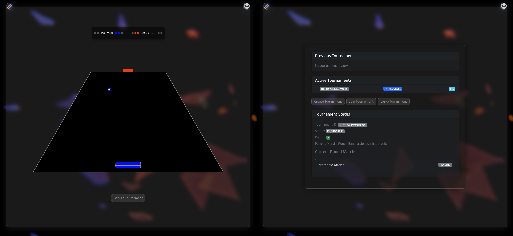

# 🕹️ ft_transcendence

**ft_transcendence** is the final and most comprehensive project at 42, designed to showcase everything you've learned—from full-stack development to security, real-time systems, and DevOps. The goal is to build a complete, secure, and interactive Pong-based web platform that supports online multiplayer games, tournaments, user profiles, chat systems, and much more.

<p align="center">
  
</p>

## 🌐 Project Overview

At its core, ft_transcendence is a real-time Pong game hosted on a web application. Beyond just Pong, the platform includes authentication, user management, multiplayer support, matchmaking, live chat, and robust security—all packaged in a fully containerized deployment.

## ✅ Mandatory Features

- 🎮 Real-time Pong gameplay with local and online players
- 🧾 Tournament system with matchmaking and player queueing
- 🧑 Registration system (with alias names per tournament)
- 🌐 Single Page Application (SPA) with history/back support
- 🔐 Form validation and HTTPS (using `wss` for WebSockets)
- 🧱 Dockerized app launchable with one command (`docker-compose up --build`)
- 🛡️ Protection against XSS, SQL Injection, and other vulnerabilities
- 🔑 Password hashing with secure algorithms

## 🔧 Technical Constraints

- **Frontend:** Vanilla JavaScript / CSS / HTML
- **Backend:** Python - Django
- **Database:** PostgreSQL
- **SPA Requirement:** Supports browser navigation (back/forward)
- **Browser Compatibility:** Works on latest stable Google Chrome

## 📦 Modules

- **User Management:** Authentication, avatars, match history, friend list
- **Gameplay:** Online multiplayer, Tournaments & AI opponent
- **Web:** Use Django, PostgreSQL, Bootstrap
- **Security:** 2FA, JWT & GDPR compliance
- **DevOps:** Monitoring (Grafana/Prometheus), logs (ELK stack), microservices
- **Graphics:** Advanced 3D rendering with Three.js
- **Accessibility:** Multi-language support, responsive design, screen reader support

## 🚀 Getting Started

```bash
git clone https://github.com/YOUR_USERNAME/ft_transcendence.git
cd ft_transcendence
docker-compose up --build
